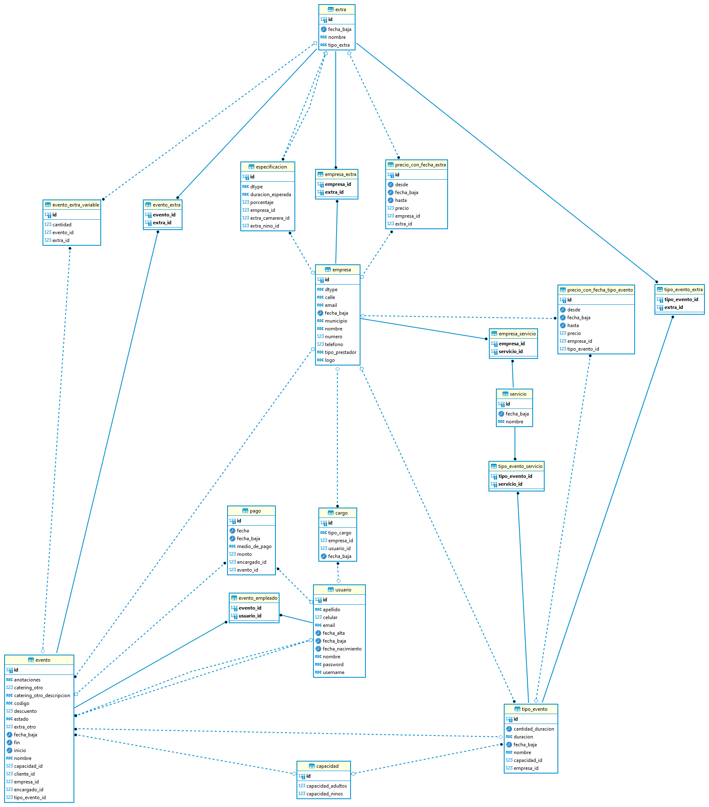

# 📒 Agendaza (FRONT-END) - Sistema de Gestión para Salones de Eventos

Agendaza es un sistema integral para la gestión de eventos en salones. Facilita la administración de reservas, clientes, catering, servicios adicionales y mucho más.

<!-- Futuras acciones de CI/CD

-->

---

## ✨ Características

- Gestión de clientes y reservas
- Administración de servicios de catering y adicionales
- Seguimiento de pagos y contratos
- Reportes e informes por evento o período

---

## 🗺️ Modelo de Entidad-Relación

---

## 🚀 Estado actual

Versión **0.5.0** — En desarrollo activo.  
Se encuentra implementado el núcleo funcional del sistema. Se planifican mejoras progresivas e integración de CI/CD.

---

## 🛠️ Tecnologías utilizadas

- Backend: Kotlin + Spring Boot
- Frontend: Angular + Bootstrap
- Base de datos: PostgreSQL
- Orquestación: Docker + Docker Compose

---

## 👥 Desarrollado por

Este proyecto fue desarrollado por **Estonian Port**.  
Visitanos en 👉 [https://estonian-port.github.io/estonianport-landingpage/](https://estonian-port.github.io/estonianport-landingpage/)

---
